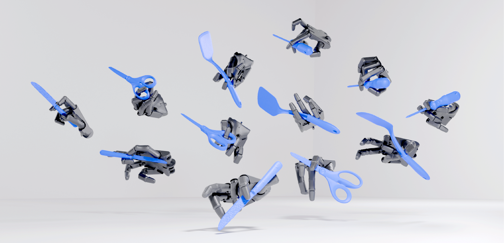
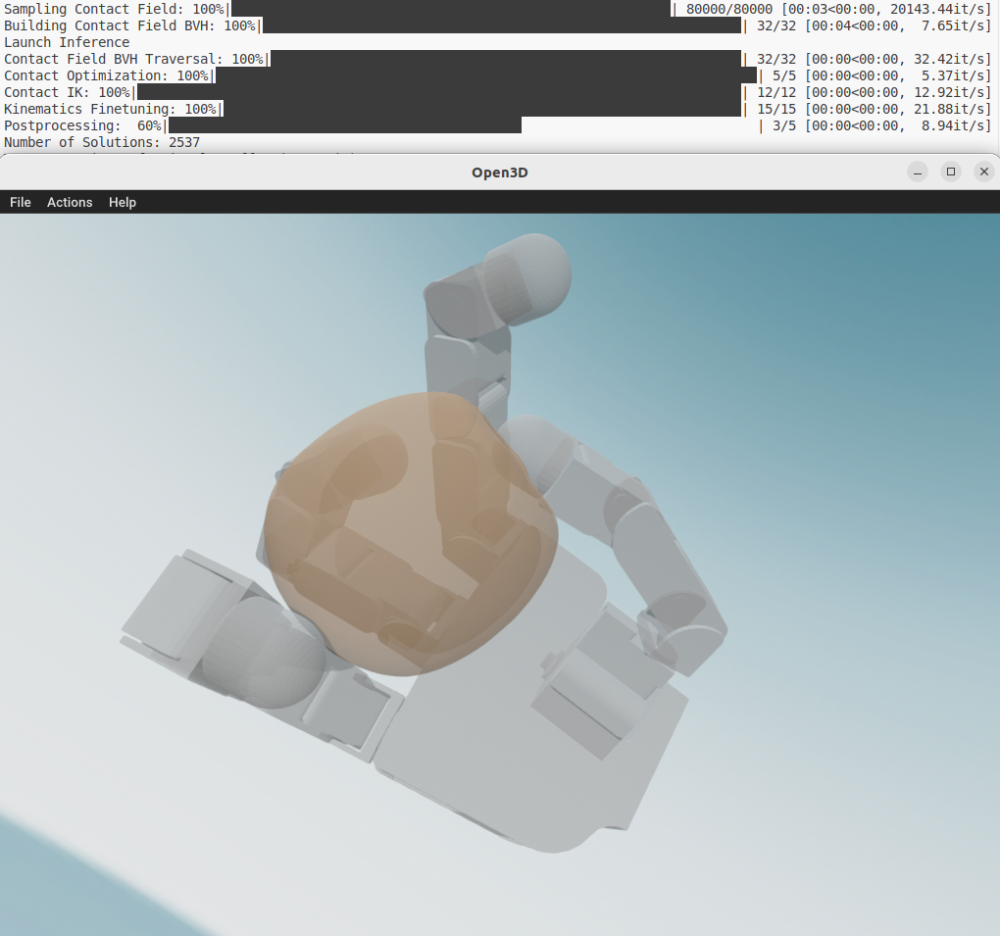

<center>

# Lightning Grasp
Public repository for the Lightning Grasp system. [paper](https://arxiv.org/abs/2511.07418)

**Thousands of dexterous grasps in seconds.** 
</center>


## System Requirements
- Operating System: Ubuntu 22.04 or 24.04
- GPU: NVIDIA GPU with Pascal, Volta/Turing, Ampere, or Ada Lovelace architecture
- CUDA 12
## Install
Follow these steps to set up the environment and dependencies.


### Step 1. Python Environment
Choose one of the following setup methods.

#### Option 1. Recommended Conda Environment (Stable)
We provide pre-configured Conda environments for different Python/CUDA combinations. For most users with modern NVIDIA GPUs (RTX 20-series and newer), we recommend:
```
conda env create -f conda_env/conda_py39.yml
conda activate lygra
```
Available environments:
- conda_py39.yml: Python 3.9 + PyTorch 2.8.0 (recommended for newer GPUs)
- conda_py38.yml: Python 3.8 + PyTorch 2.4.1 (for legacy systems)

#### Option 2. Lightweight PIP Installation (Minimal)
Not sure if you are tired of setting up a new heavy-weight environment for every new thing. 

If you prefer a minimal setup and already have Python 3.8/3.9 and pytorch installed:
```
pip install open3d==0.19.0 urdfpy==0.0.22 trimesh==4.9.0
pip install networkx==3.2.1
```
Done. (Do not merge these pip install into one line)


### Step 2. Setup CUDA Binaries
This release includes pre-compiled CUDA kernel binaries. The CUDA C++ source code will be published in a future release.

**Setup Steps:**
1. Download the appropriate compiled binaries for your Python version from the [Releases page](https://github.com/zhaohengyin/lightning-grasp/releases)
2. Extract the downloaded files into the `lygra/cpp/build/` directory
3. Verify the file structure matches:
```
lygra/cpp/build/lbvh/lbvh.so
lygra/cpp/build/geometry/geometry.so
```

### Step 3. Setup Assets
Download hand and object assts from the [Releases page](https://github.com/zhaohengyin/lightning-grasp/releases), and put them under the ``./assets`` folder. Verify the file structure matches:

```
./assets/hand/...
./assets/object/...
```


## Run
Run a single forward pass demo with visualization:
```
python demo.py --visualize
```
This will visualize results on Allegro + YCB Apple setup. 


To use other hands and objects, run:
```
python demo.py --visualize --robot shadow --object_mesh_path ./assets/object/ycb/042_adjustable_wrench/textured.obj
```
Ensure your object mesh is scaled to meter units before processing. ;)

The supported hands are shown in ``lygrasp/robot/__init__.py``. We provide several examples in the repository. Please refer to the next section to setup your own hands.

The system includes several tunable parameters to optimize performance for your hardware and use case:

- **`--n_contact`**: Controls the number of active contacts to search during grasp optimization
- **`--batch_size_outer`** & **`--batch_size_inner`**: Adjust these values to maximize GPU utilization
  - For GPUs with large memory (≥ 12GB), increase both batch sizes for better performance
  - Start with default values and scale up until memory limits are reached
  - Some typical setups: (128, 256), (192, 256), (256, 256), (256, 512).

## Setup Your Model
There are several examples in ``lygra/robot/`` folder. You can refer to ``lygra/robot/allegro.py`` for an tutorial. Basically, you simply need to setup a config object that specifies the contact field rules (i.e. which patches to use defined by allowed normals), canonical object space (i.e. where to initialize the object), and some URDF metadata. That's it!

## Notes
**Known Limitations**

This released version has the following limitations.
- The kinematics module does not support mimic joint. The hand DoF must be fully actuated.

- Do not use huge objects for now. I am working on a version that clamps the object mesh and resample the point cloud after placement.

**Comments**

For the grasp synthesis with grippers, consider using specialized approaches for higher efficiency (i.e. directly sample antipodal points on a ray.).


## Troubleshooting:
- If you encounter "Package X not found" errors, simply run ``pip install X``.
-  If you find any error message containing ```networkx```, just run
```
pip install networkx==3.2.1
```

For other problems, leave an issue or email me ``zhaohengyin@cs.berkeley.edu`` (I can be quite busy, but I’ll do my best to respond as soon as I can).
## License
CC-By-NC 4.0. 

[](https://creativecommons.org/licenses/by-nc/4.0/)


This software and its generated data are licensed for academic and research use only. The license does not grant rights for commercial application, including but not limited to:

- Integration into commercial systems
- Commercial services using this software/data

A separate commercial license is required for any business use. Please contact the author for licensing terms.

## Bibtex
If this work helps your research, a citation would be greatly appreciated!
```
@article{yin2025lightninggrasp,
  title   = {Lightning Grasp: High Performance Procedural Grasp Synthesis with Contact Fields},
  author  = {Yin, Zhao-Heng and Abbeel, Pieter},
  journal = {arXiv preprint arXiv:2511.07418},
  year    = {2025},
  url     = {https://arxiv.org/abs/2511.07418}
}
```
